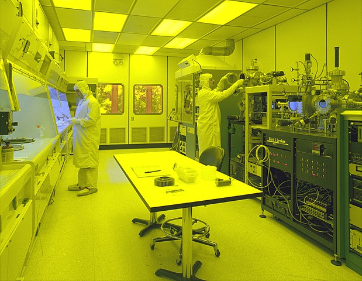

# Clean

>  Clutter reflects of attitudes about one's environment, which mirrors our internal state of control. However, excessive amounts of polish can indicate a compulsion or intolerance towards natural levels of disorder, leading to an obsessive habit and repulsions, ultimately causing neurotic fragility. Please clean responsibly.

[Cleaning](https://en.wikipedia.org/wiki/cleaning) is the process of removing unwanted substances from an object or environment. This behavior appears in many contexts and varying scales of organization -- from individuals to institutions -- but is most commonly associated with biological organisms. Many social animals practice mutual grooming such as cats, birds, and primates.

Cleaning is demonstrated in the many organisms such as the aptly named [cleaner fish](https://en.wikipedia.org/wiki/Cleaner_fish), which forms symbiotic relationships with other aquatic species. Some other fishes have evolved to mimic their conspicuous coloration to gain a competitive advantage which diminishes the mutualistic effect of actual cleaner fish. 

In humans, widespread practice of cleaning likely coincided with the transition from nomadic-hunter tribes to agrarian-based settlements, in which labor was divided between the sexes, normalizing gender roles through genetic and cultural selection (of traits and behaviors) that ingrained these divisions to be associated with gender. Additionally, the subsequent growth in population and rise of social-economical partitions led to elaborate hierarchies, delineating groups through stratification of caste (*e.g.* ethnicity, nobility, wealth) and the development of rituals and enforcement (through custom, rules, laws) of  city-states, kingdoms, and empires; privilege and power concentrated in the control of a few while the underclass masses served and labored (sometimes to some mutual benefit, such as stability and continuation of traditional belief systems). The Victorian period exemplifies the lavish excesses afforded by the hierarchical specialization of servants. The ensuing industrialization continues to preserve these inequalities of wealth and capital through feedback mechanisms. Now, commercialization of cleaning services is routine and encompass specialized cleaning occupations: chimneys, windows, carpets, cars, swimming pools). Entire sectors such as the semiconductor industry necessitate environments free of dust and other particulate matter employing elaborate air filtration systems and formalized procedures to ensure cleanliness.

**What are the side effects of cleaning?**
Removal of ecological pollutants from inhabited environments is usually considered beneficial in society, although externalities can prevent proper disposal of some types of waste. For the individual family, a clean household may have several beneficial health effects such as lower rates of allergies and diseases from harmful bacteria, fungus, and insects. Cleaning can also have acute psychological effects. Failure to regularly clean oneself and one's habitat can be indicative of mental disorders such as depression or [hoarding](https://en.wikipedia.org/wiki/Hoarders_(TV_series)); excessive cleaning is correlated with obsessive-compulsive personalities and neuroticism. The act of cleaning can emotionally symbolize individual agency and exercise of volition, a power to be able to directly influence local surroundings through the act of cleaning. However, any activity necessary expends energy resources and some utilize strategies such as [simple living](https://en.wikipedia.org/wiki/Simple_living) to reduce the amount of material possessions that need cleaning, which some also claim as signifying a rejection of modern consumer society; a freedom from the objects that occupy and clutter not only physical but mental space.

**A philosophy of cleaning**
The repetitious and pedestrian characteristic of cleaning is reminiscent of a Sisyphus-like task --- the never-ending balancing act of our desire to instill order and control against a chaotic world that surpasses individual through continual reminders of mortality and insignificance. In tidying up what little we can, we are comforted in what is a simple routine, repetitive but familiar. Like when the encroaching neighbor that mows your lawn, we are protective of our territory and explicitly mark their known (or claimed) boundaries with signifiers of dominance, if merely the trimming of our hedges or the painting of our fences. This ritual delineates the extension of ourselves onto our possessions from the unknown wilderness: the abandoned yards, the pathless forest, unincorporated territory. Cleaning represents a re-exploration and continual affirmation of the uncertain, undetermined boundaries. We do not often venture beyond the these liminal spaces.

